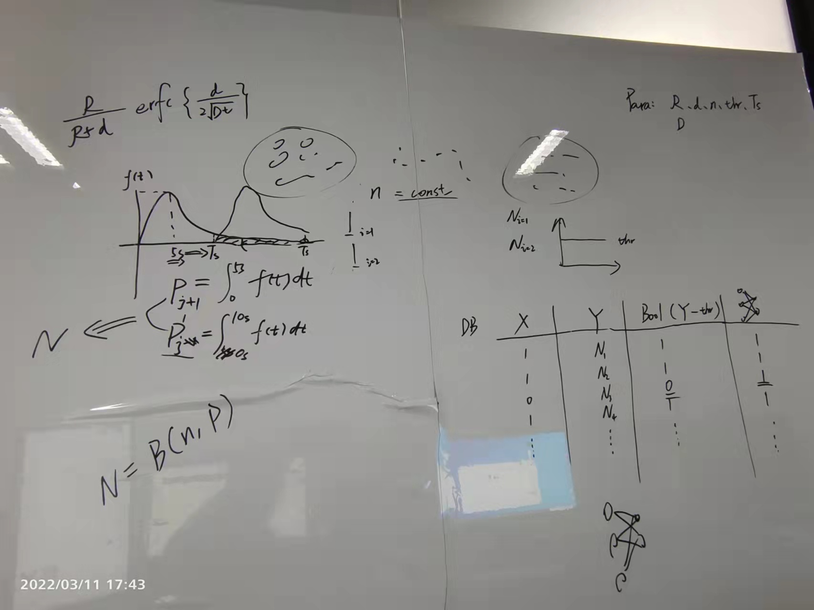
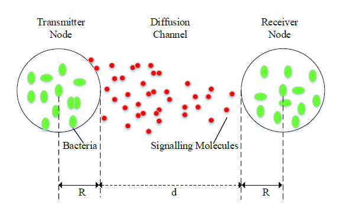
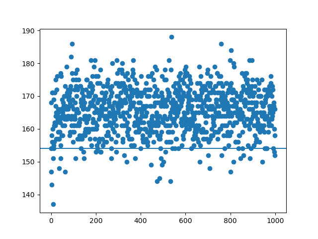

# Transformer Based Receiver Design in Molecular Communication : a novel insight from NLP

## pipeline

1. generate random signal (0 or 1)
2. caculate the probability P of the arrived signal autoinducer
3. caculate the num of the arrived ai (autoinducer) by P
4. minus threshold to get the receiver signal (0 or 1)

## parameters

## the probability function

## the FCN test result

