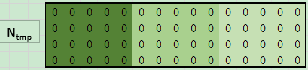

# MCFormer: A Transformer-Based Detector for Molecular Communication with Accelerated Particle-Based Solution

This repository is for the paper "MCFormer: A Transformer-Based Detector for Molecular Communication with Accelerated Particle-Based Solution"

[source document](https://ieeexplore.ieee.org/document/10210368)

[Abstract file](https://xiwen-lu.netlify.app/publication/mcformer/)

[Pdf file](https://xiwen-lu.netlify.app/publication/mcformer/mcformer.pdf)

## file structure

| file folder | usage                                                                |
| ----------- | -------------------------------------------------------------------- |
| /Data/      | the data used in paper experiments                                   |
| /logs/      | the training loss and validation accuracy data                       |
| /pics/      | the pictures drawn by experiment data                                |
| /settings/  | different settings for model running with different drift velocity v |
| /Weights/   | Weights file for the trained model                                   |

| python file                       | usage                                                       |
| --------------------------------- | ----------------------------------------------------------- |
| data_generate_BrownianMotion      | our accelerated particle-based solution for data generation |
| dataset                           | for models to read data                                     |
| Model_DNN                         | the DNN model                                               |
| Model_MCFormer                    | the MCFormer model with training and testing function       |
| train_DNN                         | for training and testing DNN model                          |
| calculate_MAP_sequence            | the MAP calculate function                                  |
| calculate_MAP_sequence_accelerate | the MAP calculate function with matrix operations           |
| Exp_BER_test                      | the BER experiment with different drift velocity            |
| Exp_SNR_test                      | the BER experiment under unknown channel noise              |

<!--## Replication of experimental results-->

## Usage

The required data can be generated using **data_generate_BrownianMotion.py**, and a custom configuration **settings.yaml** file can be used for DNN or MCFormer models to call data and store models.

If you want to reproduce the experiments in the paper, you can run **Exp_BER_test.py** and **Exp_SNR_test.py** directly.

## More details about data generation algorithm

It uses matrix operation to substantially expedite the data generation process.
The more details can be seen below:

**step 1** : Calculate the effect step $K_e$，e.g. $K_e=3$.

**step 2** : Iterate through the transmitted signal sequence, e.g. S=[1,1,1,0,0].

**step 3** : For each transmitted signal si=1, create a matrix $N_{tmp}(M,K_eT)$ to save which moments particles are observed, e.g. M=4, T=5$\Delta t$.

**step 4** : Produces net displacement matrix of M particles in each moment. The net displacement in the x-axis direction obeys $\mathcal{N}\left(v\Delta t,\sqrt{2\mathrm{D}\Delta t}\right)$, and the y- and z-axis directions obey $\mathcal{N}\left(0,\sqrt{2\mathrm{D}\Delta t}\right)$, e.g. $v=30\mu m/s,\Delta t=0.04 s, T=0.2 s$.

**step 5** : Accumulate and obtain the coordinate matrix of the particles at each moment.

**step 6** : Calculate the distance between particle and the receiver center point (with the broadcast mechanism in Python.

**step 7** : Mark the moments where distance is less than the receiver radius as ``1" in $N_{tmp}$, for better demonstrating, here use 10 as receiver radius.

**step 8** : Sum along the axis of the particle (axis=1) and superimpose on the final sequence of results.

**step 9** : Repeat **Step 3** to **Step 9**, until the whole sequence is end.

**step 10** : By sampling the final sequence Ntotal, get the received sequence N, e.g. N=[4,4,3,0,0].

## Representations

All authors using this work need to cite this article

> @ARTICLE{10210368,
author={Lu, Xiwen and Bai, Chenyao and Zhu, Aoji and Zhu, Yunlong and Wang, Kezhi},
journal={IEEE Communications Letters},
title={MCFormer: A Transformer-Based Detector for Molecular Communication with Accelerated Particle-Based Solution},
year={2023},
volume={},
number={},
pages={1-1},
doi={10.1109/LCOMM.2023.3303091}}
